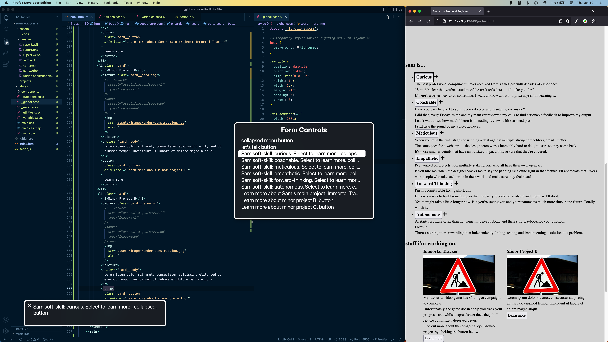
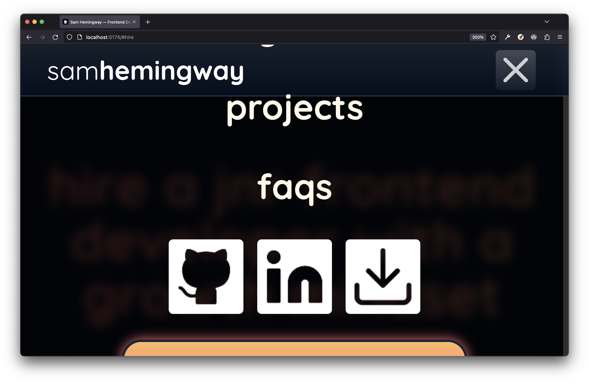

# Things I learned building this site

- [Things I learned building this site](#things-i-learned-building-this-site)
  - [TL;DR](#tldr)
  - [Letting go of pixel perfection](#letting-go-of-pixel-perfection)
  - [Accessibility](#accessibility)
    - [Useful links](#useful-links)
  - [React stuff](#react-stuff)
    - [CSS Modules vs CSS in JS](#css-modules-vs-css-in-js)
    - [Context](#context)
  - [Libraries](#libraries)
    - [Framer Motion](#framer-motion)
    - [Radix UI / Headless UI](#radix-ui--headless-ui)
  - [SVGs](#svgs)
  - [Optimisation/reliability](#optimisationreliability)

## TL;DR

**This was my first React app that I created from scratch!**
As such, I learned more than I can cover here. But from the top of my head:

- Don't be afraid to ask for help: having access to Discord/Slack communities was a lifesaver.
- The importance of Context to make certain state/constants available throughout the app.
- Learning to drop the dream of pixel perfection when following a Figma design.
- How to think in components, and building a mental model for how these components actually compile into a DOM tree.
- The React lifecycle: it's almost embarassing the amount of times I tried to implement a `useEffect()` hook thinking it would run at that point in the code, rather than after the component had finished rendering.
- Accessibility: easy when writing vanilla HTML, a different animal when incorporating 3rd party libraries in React.

## Letting go of pixel perfection

Before starting coding, I tested ideas on a site design in Figma. Once I started coding, I started to notice that parts of the design were too static to translate well to a living website.

- For example, I realised that the distances between the strokes on the phased effect on the headshots needed to be fluid depending on viewport size (otherwise, they were too big on small viewports or too small on large ones).
- When I implemented this, the rest of the design started to feel static in comparison.
- As such, I incorporated fluid scales for spacing/sizing sitewide.
  - This meant that the font-sizes etc. were always slightly different from the static values in the Figma file.
  - I did my best to maintain the general feel of the space between elements, and feel like in the real world our team would be able to have a dialogue with the design team to explain why we went down this route.

## Accessibility

**Testing for accessibility was a very interesting and fun challenge to solve.**

- Whilst in the design stage, I focused on a colour scheme that would at least achieve a contrast ratio satisfying a AA rating.
- I initially built a basic skeleton of the site in vanilla HTML to test the site with a screen-reader (VoiceOver) to ensure things like my `aria` attributes were working correctly.
  
  - I then used the HTML as a reference when building my React components.
- Whilst styling, as much as possible, I made an effort to consciously use units such as rems to respect users who set the text on their device to be larger (hello, mum)!
- Once the site was completed, I ran through again with VoiceOver to make sure everything still worked.
- I then ran through the site with the tab key and discovered/fixed a few bugs.
- After this, I checked what the site looked like at 300% zoom and discovered this peach of a bug:
  
- I then considered people like my partner, who choose to disable motion on their iPhones as it makes them uncomfortable.
  - This was a suprisingly tricky problem to solve when using Framer Motion as their blanket "respect reduced motion" option simply introduced various bugs across browsers.
  - As such, I had to build separate animation variants for whether the user had requested reduced motion or not.
- Finally, I ran a WAVE report on the site to make sure I've not missed anything silly. [Success!](https://wave.webaim.org/report#/samhemingway.dev)

### Useful links

- [The a11y checklist](https://www.a11yproject.com/checklist/) helped me plan what I needed to do.
- [5 takeaways from screen reader usability interviews](https://jessbudd.com/blog/screen-reader-usability-testing-observations/) by [Jess Budd](https://jessbudd.com) helped me test screen-readers effectively by mimicking how actual un-sighted users navigate websites. I learned a lot!
- [ARIA Authoring Practices Guide](https://www.w3.org/WAI/ARIA/apg/) - outrageously useful.
- [This article on inclusive menu buttons](https://inclusive-components.design/menus-menu-buttons/) and [This article on inclusive collapsible sections](https://inclusive-components.design/collapsible-sections/) from [Heydon Pickering](https://heydonworks.com) were excellent. Not only did they help me build accessible components, but more importantly, he explains the reason why we're doing what we're doing so you can learn instead of just copy/pasting.

## React stuff

### CSS Modules vs CSS in JS

I opted to use CSS Modules in this design, to see how it felt as I'd heard good things about it performance wise.

**Pros**:

- Working with a separate css file is how I was already used to working from vanilla.
- Not having to worry about class names was a god-send. Goodbye BEM!

**Cons**:

- Biggest by far was not being able to programatically change styles with JS.
  - I mean, you can, but it's ugly: you have to create a new style for each state in your CSS file, then incorporate an expression slot to choose which one to use.
  - This required more mental overhead then I'd like, and I lost more than a few hours debugging when I forgot to update a style in the separate CSS file.

In my next project, I'm gonna try out Styled Components — I'm sure the performance benefits of CSS modules would make a difference on a larger scale website, but I feel like at the scale I'm working right now the DX will be much better using CSS in JS. I'm still certain that there are useless CSS decorations littered all over my code across dozens of CSS files, but determining which ones I can remove and which ones are necessary is a path to madness.

### Context

I also now feel like I've got a much better grip on when to use Context, and generally how to structure even a small site like this.

- When refactoring, I realised that I was re-using the same Framer animations in multiple different places. This made updating them a complete ball-ache.
  - As such, I centralised them into an Animation Provider context that took care of all variants and business logic behind them (e.g. should we disable the intro animations on a refresh, make sure we respect `prefers-reduced-motion` etc.)
- In the future, I'll know to do this kind of thing from the start rather than spend time later re-centralising them when it becomes a problem!

## Libraries

For this site, I decided to take a stab at incorporating 3 different libraries (Framer Motion, Radix UI and Headless UI) to get experience learning how to use them purely from their docs.

I learned very quickly that there's a reason a number of voices in the industry urge caution when using them.

- The learning curve to start using them pretty much wiped out any time savings I made from not having to build things from scratch.
  - However, in my next project, I'm sure the benefits will be more obvious.
- I discovered that incorporating animation libraries like Framer Motion into component libraries is a bit of a mind-fuck, but I got there in the end.

Despite that, I'm glad I challenged myself to learn them. Mostly from the point of view that it pushed me to develop my ability to learn things indepedently rather than having my hand held the entire time.

### Framer Motion

I decided to use this library for 2 reasons:

1. I was trying to animate the hamburger menu icon, and every tutorial I could find that used vanilla CSS would simply not work cross-browser (hello mobile Safari).
2. I wanted easy spring animations.

As such, I figured a battle-tested, production ready library would satisfy these requirements.

Like most things, this library felt easy to learn the basics but difficult to master.There were some snags along the way in terms of respecting `prefers-reduced-motion` that I was hoping a library like this would solve much better, but unfortunately it didn't.

### Radix UI / Headless UI

I used these libraries to implement the mobile modal when using the mobile navigation via the hamburger menu, and the collapsible cards.

Not much really to say on this, they did the job: I didn't have to worry about implementing features such as tab focus, `esc` key to close the modal etc.

But the time it took to learn the syntax/API for these libraries was probably about equal in terms of how much time I'd have taken to build them from scratch.

Out of the 2, I have to say I prefered Headless UI - even though their examples used Tailwind exclusively, I still found their docs/API easier to learn.

## SVGs

I felt obliged to give SVGs get their own dedicated section as I spent so much time learning them for this portfolio site.

I realised fairly early on that if I wanted to achieve a satisfactory level of polish with icons such as the hamburger icon animating, then inline SVGs were the only way to go.

This lead to a very fun and interesting journey into how to build them with code, and how to animate them using Framer Motion.

The main take-away: animate SVG paths, not rectangles!!!

## Optimisation/reliability

Confession: I probably got the most satisfaction out of trying to optimise this site than anything else I did in it's creation...

The largest files on this site, like most, came down to assets such as fonts and images.

- Thankfully, Vite supports tree-shaking, so when building for production it took care of discarding and parts of the libraries that I wasn't using.
- In terms of images, using `.avif`/`.webp` rather than `.png` reduced filesizes by up to 90% (!!!). I simply used Squoosh to build optimised images manually, but in the future I'm interested to learn how to incorporate this into my build step automatically as many sites will have so many images that converting them manually will be impossible.
- In terms of fonts, I grabbed the optimised versions from Google Fonts directly and incorporated them into my website to eliminate a dependency. I also don't really trust Google not to throw some creepy tracking shit in there, as that's their business model.
